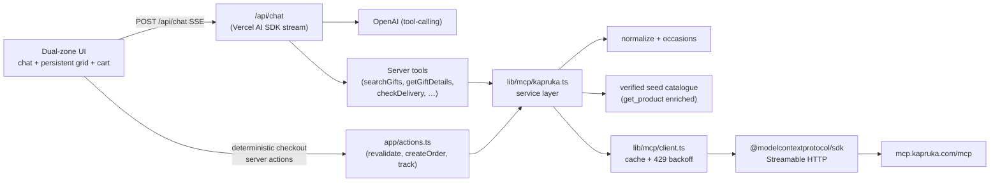
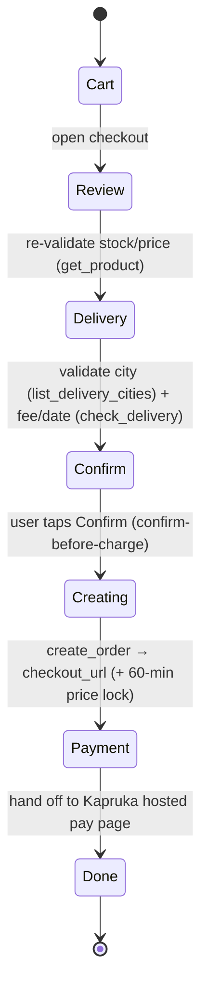

# Architecture — Ruka

This document explains the decisions, data flow, state model, what's real vs. mocked, and what's intentionally out of scope.

## 1. Product framing: a gift concierge, not a store

The Kapruka MCP order model is recipient + sender + delivery city/date + gift message + cake `icing_text`, and the categories are occasion-rich (`birthday`, `anniversary`, `valentine`, `wedding`, `mother`, `lover`, `sympathies`, `corporate`). So Ruka is framed around _"who are you gifting, and for what occasion"_ rather than a search box. This is both truer to the domain and more reliable (see §5).

## 2. System overview



Two entry points hit the **same service layer** (`lib/mcp/kapruka.ts`):

- **The agent** (`/api/chat`) calls server tools (`lib/agent/tools.ts`) for discovery/persuasion.
- **The deterministic checkout** calls **server actions** (`app/actions.ts`) directly from the client — no LLM in the money path.

## 3. Layers

| Layer            | File(s)                              | Responsibility                                                                 |
| ---------------- | ------------------------------------ | ------------------------------------------------------------------------------ |
| Transport        | `lib/mcp/client.ts`                  | Streamable HTTP MCP client, in-memory TTL cache, retry + 429 backoff, JSON parse + error decoding |
| Normalize        | `lib/mcp/normalize.ts`               | Clean mangled entities/tag-soup, map raw payloads → domain types               |
| Service          | `lib/mcp/kapruka.ts`                 | `searchGifts` (resilient + seed fallback), `getGift`, `listDeliveryCities`, `checkDelivery`, `createOrder`, `trackOrder` |
| Catalogue        | `lib/catalog/*`                      | Curated occasions, the harvested seed catalogue, search/featured helpers       |
| Domain           | `lib/commerce/*`                     | Channel-agnostic types, Zustand store, Asia/Colombo date helpers               |
| Agent            | `lib/agent/*`                        | Ruka persona (system prompt) + Zod-typed server tools                          |
| UI               | `components/*`                       | Landing, dual-zone shell, chat, product surfaces, cart, checkout, tracking     |

The cart/checkout domain (`lib/commerce`) is deliberately UI-agnostic so the same logic could drive a different surface.

## 4. Checkout state machine

Separate, verifiable steps so "intent" never silently becomes "charge" (Google's three-mandate model):



**Visible, graceful handling** for: empty cart, out-of-stock or unavailable mid-flow, price change before confirm (one-tap accept), `city_not_deliverable` (routed back to the delivery step), past/non-deliverable date, pay-link expiry, and rate-limit/transport errors. Error codes returned by `create_order` are mapped to the step the user can fix.

## 5. Search reliability (the key engineering problem)

First-hand testing (logged in [`../research/mcp-findings.md`](../research/mcp-findings.md)) showed `kapruka_search_products` is **intermittently empty** — the same query returns products one evening and "No products found" the next morning — while `get_product`, `list_categories`, `list_delivery_cities`, `check_delivery`, and `create_order` are rock-solid. Pairing a query with a category is much more reliable than a bare keyword.

Mitigations, in order:

1. **Anchor on occasions.** Free text is mapped to a curated occasion with a verified `{query, category}` pair. This is the most reliable live path _and_ the right product model.
2. **Resilient attempts.** `searchGifts` tries query+category, then the occasion's canonical query+category, then bare query, then the leading token — capped to keep within the rate limit.
3. **Verified seed catalogue.** When live search is empty or the transport fails, we fall back to `lib/catalog/seed.json` — 90 real products across 13 verticals, harvested from Kapruka's public category pages and enriched through the reliable `get_product`. The homepage rails and "today's favourites" are powered by it too, so the app is never empty.

Net effect: when search is healthy, results are live and fresh; when it isn't, the experience is still rich, real, and orderable.

## 6. Real vs. mocked

| Capability                        | Real?   | Notes                                                                 |
| --------------------------------- | ------- | --------------------------------------------------------------------- |
| Product details, prices, stock    | ✅ Real | `get_product` (LKR).                                                  |
| Delivery cities + fee + warnings  | ✅ Real | `list_delivery_cities`, `check_delivery`.                             |
| Order creation + pay link         | ✅ Real | `create_order` → live `checkout_url`, `order_ref`, 60-min price lock. |
| Order tracking                    | ✅ Real | `track_order`.                                                        |
| Discovery search                  | ✅ Real, with seed fallback | Live when healthy; verified seed catalogue when not.    |
| Seed catalogue                    | ✅ Real products | Harvested + `get_product`-enriched; refreshable via the script.  |
| Payment capture                   | 🔁 Handed off | Completed on Kapruka's hosted page — by design (no PCI scope).   |

Nothing about money or stock is fabricated by the model.

## 7. Performance & limits

- Read calls are cached in-memory (30 min for product/category reads, matching the MCP's own window; shorter for delivery quotes). This protects the shared per-IP rate limit (60 req/min, 30 orders/hr).
- The MCP SDK is `serverExternalPackages`; the chat route runs on the Node.js runtime.
- Product images use the Kapruka CDN directly with a branded fallback (`SmartImage`), so a missing image never shows a broken box.

## 8. Real-time voice (Pipecat + Gemini Live)

Voice is a first-class mode, not a bolt-on. The design principle: **one brain, two mouths.** Text and voice share the same persona, catalogue, cart, and checkout — they differ only in the transport and the model.

```mermaid
flowchart LR
  subgraph Browser["Browser (one Next.js app)"]
    UI["Dual-zone UI + Call Ruka overlay<br/>(shared Zustand store)"]
  end
  UI -->|text: POST /api/chat SSE| Chat["/api/chat → OpenAI"]
  UI <-->|voice: WebRTC audio| Voice["voice/ (Python, :7860)<br/>Pipecat + Gemini Live"]
  Voice -->|speech-to-speech, multilingual| Gemini["Gemini Live<br/>(native audio, Sinhala)"]
  Voice -->|tool calls: HTTP| VT["/api/voice-tools"]
  Chat --> Service["lib/mcp/kapruka.ts<br/>(resilient search + seed + delivery)"]
  VT --> Service
  Voice -.->|RTVI server-message<br/>(products / add-to-cart / open-checkout)| UI
```

Key decisions:

1. **Separate Python service.** Pipecat is Python and holds a long-lived WebRTC/audio pipeline, which Vercel's serverless functions can't host. So `voice/` is its own process (Pipecat's dev runner serves `POST /api/offer` on `:7860`); the Next.js app stays on Vercel. The browser connects with `@pipecat-ai/client-react` over SmallWebRTC (peer-to-peer, no third-party media account).
2. **Gemini Live for speech-to-speech.** One model does VAD, transcription, reasoning, tool-calling, and native-audio output — no separate STT/TTS. Its native-audio model is **multilingual**, so Ruka understands and replies in English, **Sinhala**, or Tanglish; the persona instructs her to mirror the caller's language.
3. **The voice bot reuses the text brain.** Its tools (`search_gifts`, `get_gift_details`, `check_delivery`, …) are thin `FunctionSchema` wrappers that call the Next.js **`/api/voice-tools`** endpoint, which dispatches to the _same_ `lib/mcp/kapruka.ts` service. There is no second catalogue implementation to drift — voice inherits the resilient search, 90-product seed fallback, normalization, and the verified delivery path for free.
4. **Voice is visual.** When the bot calls a tool, the Python service pushes a structured payload to the browser as an RTVI `server-message` (`RTVIServerMessageFrame`). A client bridge (`components/voice/VoiceBridge.tsx`) applies it to the shared Zustand store, so the call renders the exact same product cards, browse grid, cart, and checkout as text. The model speaks the steer; the screen shows the detail.
5. **Money stays deterministic.** Voice handles discovery, persuasion, add-to-cart, and _opening_ checkout — but delivery capture, the confirm-before-charge checkpoint, and `create_order` run through the same on-screen state machine (§4). The voice model never touches the money path, mirroring the text design.

The voice layer is loaded client-only (`next/dynamic`, `ssr:false`) because the WebRTC libraries are browser-only. Implementation lives in `voice/` (Python) and `lib/voice/` + `components/voice/` (client); see [`../voice/README.md`](../voice/README.md).

## 9. Out of scope (intentional)

- **Login / saved accounts** — the MCP is guest-checkout only.
- **In-app card capture** — payment completes on Kapruka's secure hosted page; we hand off by design.
- **Automatic post-payment tracking** — Kapruka emails the order number after payment, so tracking is manual entry.
- **Multi-currency UI** — the app is LKR-first (the seed catalogue is LKR); the `create_order` currency is wired but not surfaced.
- **Variant-level ordering** — the MCP cart takes `product_id` only; variants are shown as information.
